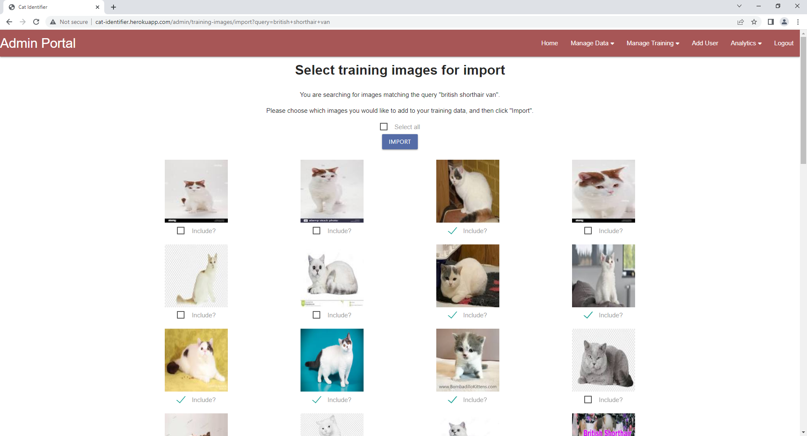
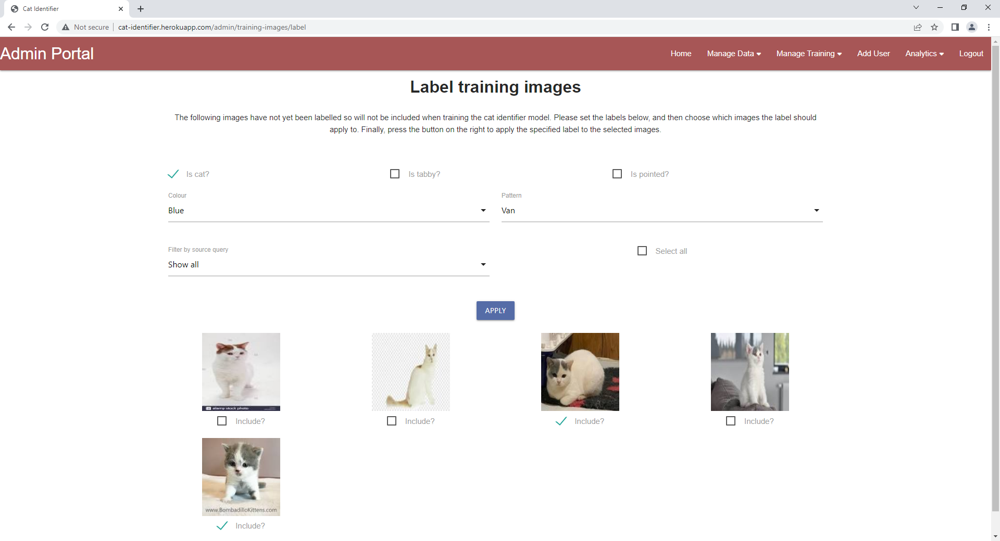
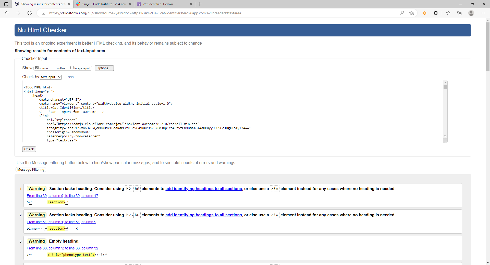
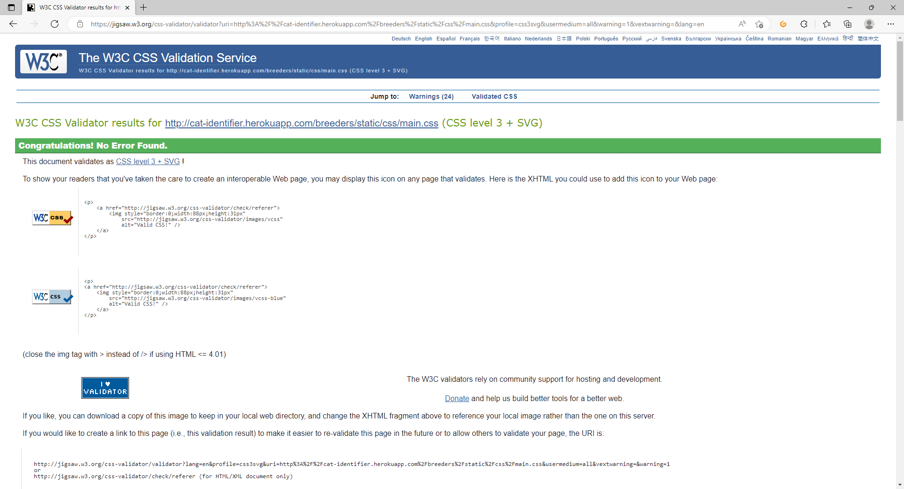
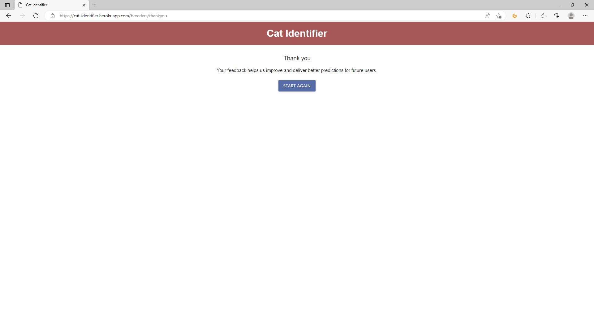
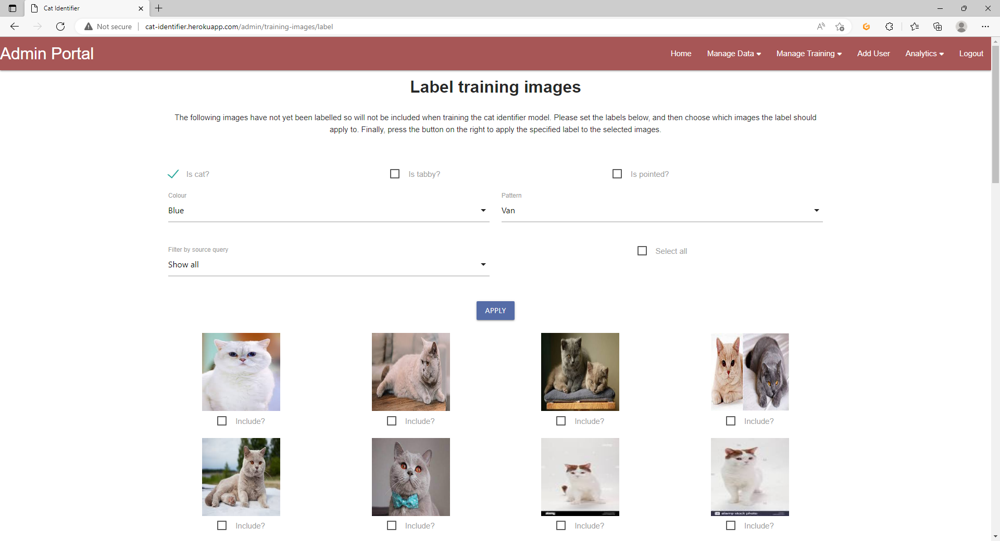

# Testing

## Browser Compatibility

### Admin Navigation

__On Edge__

The following image shows the admin navigation bar in Edge:

__On FireFox__

The following image shows the admin navigation bar in FireFox:

__On Chrome__

The following image shows the admin navigation bar in Chrome:

### The Breeder Upload Journey

__On Edge__

The following image shows the breeder upload landing page in Edge:

The following image shows the breeder file selection process in Edge:

The following image shows the breeder results page in Edge:

__On FireFox__

The following image shows the breeder upload landing page in FireFox:

The following image shows the breeder file selection process in FireFox:

The following image shows the breeder results page in FireFox:

__On Chrome__

The following image shows the breeder upload landing page in Chrome:

The following image shows the breeder file selection process in Chrome:

The following image shows the breeder results page in Chrome:

### Selecting Images For Import

__On Edge__

The following image shows the admin selecting images for import in Edge:

__On FireFox__

The following image shows the admin selecting images for import in FireFox:

__On Chrome__

The following image shows the admin selecting images for import in Chrome:

### Labelling Training Images

__On Edge__

The following image shows the admin labelling images in Edge:

__On FireFox__

The following image shows the admin labelling images in FireFox:

__On Chrome__

The following image shows the admin labelling images in Chrome:

### The Training Status Console

__On Edge__

The following image shows the training status console in Edge:

__On FireFox__

The following image shows the training status console in FireFox:

__On Chrome__

The following image shows the training status console in Chrome:

### Dashboards

__On Edge__

The following image shows the model performance dashboards in Edge:

The following image shows the training image reports in Edge:

__On FireFox__

The following image shows the model performance dashboards in FireFox:

The following image shows the training image reports in FireFox:

__On Chrome__

The following image shows the model performance dashboards in Chrome:

The following image shows the training image reports in Chrome:

## Code Validation

### HTML Validation
All validation errors identified during the development of the application were resolved.

The only exception that remains are warnings indicating that the sections that are used for the different parts of the application have no headers. I decided to ignore these warnings as adding headers would have undermined the layout of the application.

The main home page was validated with no errors:

The breeder upload page was validated with no errors:

The breeder results page was validated with no errors:

The feedback confirmation page was validated with no errors:

The admin login page was validated with no errors:

The admin home page was validated with no errors:

The upload images page was validated with no errors:

The image upload confirmation page was validated with no errors:

The image search page was validated with no errors:

The image selection page was validated with no errors:

The import confirmation page was validated with no errors:

The labelling page was validated with no errors:

The labelling confirmation page was validated with no errors:

The review predictions page was validated with no errors:

The review confirmation page was validated with no errors:

The start training page was validated with no errors:

The check training status page was validated with no errors:

The add user page was validated with no errors:

The analytics page was validated with no errors:

### CSS Validation
The CSS was validated through W3C's jigsaw validator and no errors were found in the CSS for the breeder app:

No errors were found in the CSS for the admin app:

### JavaScript Validation

JSHint was used to validate the JavaScript for both the breeder and admin apps.

No validation errors were found for the breeder app:

No validation errors were found for the admin app:

In both applications, JSHint highlighted identifiers which are referenced but not declared. In all cases, these were actual declared either in the
Flask template of the file or in one of the three JavaScript frameworks used by the application (Materialize, JQuery, Charts.js). Where identifiers
are declared in Flask templates, this is typically because the identifier is a constant whose value is set using a Jinja expression.

In both applications, JSHint highlighted identifiers that are unused. In all cases, these identifiers are functions that are used outside of the
JavaScript file.

### Python Validation

Python was validated using the Pylint extension in VSCode. Any major inconsistencies in style were remediated.

## Responsiveness

### Admin Navigation

__On Desktop__

The following image shows the admin navigation bar on a desktop:

__On Mobile__

The following image shows the admin navigation bar on a mobile:

### The Breeder Upload Journey

__On Desktop__

The following image shows the breeder upload landing page on a desktop:

The following image shows the breeder file selection process on a desktop:

The following image shows the breeder results page on a desktop:

__On Mobile__

The following image shows the breeder upload landing page on a mobile:

The following image shows the breeder file selection process on a mobile:

The following image shows the breeder results page on a mobile:

### Selecting Training Images for Import

__On Desktop__

The following image shows the admin selecting images for import on a desktop:

__On Mobile__

The following image shows the admin selecting images for import on a mobile:

### Labelling Training Images

__On Desktop__

The following image shows the admin labelling images on a desktop:

__On Mobile__

The following image shows the admin labelling images on a mobile:

### The Training Status Console

__On Desktop__

The following image shows the training status console on a desktop:

__On Mobile__

The following image shows the training status console on a mobile:

### Dashboards

__On Desktop__

The following image shows the model performance dashboards on a desktop:

The following image shows the training image reports on a desktop:

__On Mobile__

The following image shows the model performance dashboards on a mobile:

The following images show the training image reports on a mobile:

## User Story Tests

### Cat Breeder or Owner Stories

**As a cat breeder or owner, I want to be able to upload a photo of my cat, so that I can find out what phenotype my cat is**

This requirement is satisfied by the ``Breeder can upload a cat photo`` feature as described in the Features section of [README.md](README.md).

To upload a cat photo, the breeder first selects the "Choose Image" button:

From here, the breeder now chooses the "Choose an Image File" button to bring up the file chooser:

Once selected, the breeder can preview their chosen image. They can either choose another image by repeating the process, or choose to upload the
image:

**As a cat breeder or owner, I want to see that my results are being calculated, so that I know the application is still working**

This requirement is satisfied by the ``Breeders can see their results are being calculated`` feature as described in the Features section of [README.md](README.md).

While the breeder's image is being uploaded, they will see a spinner dialog:

**As a cat breeder or owner, I want to see how the application has classified my cat's photo, so that I can identify what phenotype my cat has**

This requirement is satisfied by the ``Breeders can see the predicted phenotype for their image`` feature as described in the Features section of [README.md](README.md).

Once the prediction has been generated, the breeder can view their result. This consists of the predicted phenotype and a display showing their
original image and a cartoon image showing what the phenotype should look like:

### Model Administrator Stories

**As a model administrator, I want to get feedback from the cat breeder or owner as to whether the predicted phenotype was correct or not, so that I can identify opportunities to improve the accuracy of the model**

This requirement is satisfied by the ``Breeders can provide feedback on predictions for model administrators`` feature as described in the Features section of [README.md](README.md).

From the breeder results screen, the breeder can choose to provide feedback on the prediction to indicate whether it is accurate or not:

If the breeder provides feedback, they will see a ``thank you`` message:

**As a model administrator, I want to be able to easily upload a large number of training images, so that I have a set of relevant training data for the machine learning model**

This requirement is satisfied by the ``Model admins can upload Zip files containing training images`` feature as described in the Features section of [README.md](README.md).

Admins can choose to upload Zip files containing training images. To do this, they first click the ``Choose a Zip File`` button as shown below:

Once they have chosen a file using the file chooser, they can then choose to upload that Zip file:

**As a model administrator, I want to see that my training images are being uploaded, so that I know the application is still working correctly**

This requirement is satisfied by the ``Model admins can see when their Zip files are being uploaded`` feature as described in the Features section of [README.md](README.md).

The model admin will see a spinner to indicate that their file is being uploaded:

Once the upload is complete, they will see a display showing which files were successfully uploaded and which were ignored:

**As a model administrator, I want to be able to search Google images for relevant training data from within the application, so that I can find images with which to train the machine learning model**

This requirement is satisfied by the ``Model admins can search Google images for relevant training images`` feature as described in the Features section of [README.md](README.md).

Model admins can also import training images from a Google search. To start this process, the admin enters a query string into the
search box and clicks the button:

The admin will see a spinner while the Cat Identifier searches Google Images:

Once the search is completed, the search results will be displayed to the admin:

**As a model administrator, I want to be able to select images to import as training data from the results returned by Google, so that I can import relevant images to my training data repository**

This requirement is satisfied by the ``Model admins can select which images to import from Google`` feature as described in the Features section of [README.md](README.md).

The admin can then tick the check boxes under each image to choose which images they would like to import as training images. There is also a
checkbox to select all retrieved images:

**As a model administrator, I want to see that my selected training images are being imported, so that I know the application is still working correctly**

This requirement is satisfied by the ``Model admins can see when their selected images are being imported`` feature as described in the Features section of [README.md](README.md).

The model admin will see a spinner while their chosen images are added to the training set:

The admin will see a confirmation screen once the import is complete:

**As a model administrator, I want to be able to apply labels to training images in bulk, so that I can quickly and easily prepare clean data with which to train the machine learning model**

This requirement is satisfied by the ``Model admins can apply labels to training images in bulk`` feature as described in the Features section of [README.md](README.md).

When the admin opts to label training images, they will see a page showing all unlabelled training images.

The admin specifies the label by indicating whether or not the images to label are of cats and if so whether the cats are tabby, are colourpoint,
and the colour and pattern of the cat.

The admin can also filter this screen based on the search term that was used to import the training images. This can make it easier to label images
in bulk since the source query acts as an informal label on the image.

Once the label has been set, the admin chooses which images to apply the label to:

Next, the admin clicks the ``Apply`` button.

**As a model administrator, I want to see that my labels are being applied to my training data, so that I know the application is still working correctly**

This requirement is satisfied by the ``Model admins can see when their labels are being applied to training images`` feature as described in the Features section of [README.md](README.md).

The admin will see a spinner while the images are being labelled:

Once the label has been applied, the admin will see a confirmation screen:

**As a model administrator, I want to be able to start the training process for new models, so that I can make trained models available for breeders and pet owners to use**

This requirement is satisfied by the ``Model admins can start the training process for new models`` feature as described in the Features section of [README.md](README.md).

To start the training process, the admin just needs to press the ``Start`` button from the ``Start model training`` page:

The admin will then be taken to the ``Check training status`` page automatically, which should confirm that training is underway:

**As a model administrator, I want to be able to check the current status of the training process, so that I can make sure the training process is working and review any errors that arise**

This requirement is satisfied by the ``Model admins can check the current status of the training process`` feature as described in the Features section of [README.md](README.md).

The admin does not need to remain on the ``Check training status`` page for the training process to complete, since training runs as a background
task. However, the admin can return to this page at any point to check the current status of training:

**As a model administrator, I want to be able to delete training images, so that I can rebalance the training dataset if needed**

This requirement is satisfied by the ``Model admins can delete training images`` feature as described in the Features section of [README.md](README.md).

Sometimes, the admin may decide that some or all of the remaining training images are not required. The admin therefore has a tool to bulk delete
images matching a specific label query. To do this, the admin selects the label attributes which images to be deleted should match:

The Cat Identifier will confirm the result of the delete to the admin once complete:

**As a model administrator, I want to see reporting about the performance of the machine learning model, so that I can identify areas to improve accuracy**

This requirement is satisfied by the ``Model admins can view reporting on the performance of the machine learning model`` feature as described in the Features section of [README.md](README.md).

On the ``Dashboards`` page, the admin can view reporting about the performance of trained models:

Two charts are available:

- The first chart shows the performance of models during training and how this has changed over time.
- The second chart shows the acceptance rate for predictions based on admin and user feedback over time.

These charts collectively allow the admin to evaluate how effective the machine learning model is.

**As a model administrator, I want to see reporting about the size and contents of the training set, so that I can identify gaps or imbalances and correct these**

This requirement is satisfied by the ``Model admins can view reporting about the training set`` feature as described in the Features section of [README.md](README.md).

Model admins can also view reporting about the training set:

Two charts are available:

- The first chart simply shows the number of training images in the training set over time.
- The second chart can be filtered by label attributes and shows the ratio of training images matching the different values for each label attribute.
For example, in the image above, the admin can see that the majority of training images are labelled but are for the ``self`` pattern. No training images for ``bicolours`` have yet been imported, and very few ``van`` images have been imported. The training set is therefore not balanced for this
attribute.

**As a model administrator, I want to be able to delete reporting data, so that I can reset the statistics if needed**

This requirement is satisfied by the ``Model admins can delete reporting data`` feature as described in the Features section of [README.md](README.md).

The admin first chooses which dashboards to clear:

The admin will then see a confirmation page indicating the outcome of the process:

## Bugs

### Fixed Bugs
More than 100 bugs were resolved during the course of this project. A sample of the kinds of issues that were resolved are presented below:

- Bug when displaying predicted phenotype was due to the word "A " being prefixed onto the phenotype ID. Removed this and added this to the display text only.
- Pressing the back button on a desktop browser allowed users to sign in again without logging out. Added validation on the login page to redirect users to admin home if already signed if.
- Prediction object could not be serialised when fetching predictions by id. Resolved this by serialising objects before returning them from the API endpoint.
- The wrong action was being used on the review prediction form. Modified to the correct action.
- The incorrect phenotype string was being displayed for non-pointed, non-tabby selfs. Updated the logic to determine phenotypes in the breeder JS.
- Base64 image data was not in the correct format. This was due to casting a byte to a string, rather than using the byte object's decode method.
- Predictions array was undefined in the admin JS on line 217. This was because the array was being initialised with the wrong value.
- An invalid response error was occurring in the clear snapshots API endpoint. This was because no response was being returned by the API.
- An exception was occurring when preprocessing training images: "cannot write mode P to JPEG". A solution from Stackoverflow was added which converts the image data to RGB before saving the image.
- The Celery worker process repeatedly threw an exception relating to working outside a Flask context. This is because the worker imported libraries which needed to reference Flask contexts. A solution from Stackoverflow which involved using factory methods was implemented.
- The breeder's feedback form was failing to submit on the breeder's results page. This was resolved by replacing the use of JQuery with document.getElementById.
- The dashboard page was failing to get analytics data if not posting a snapshot first. This was resolved by the additional of conditional logic.

### Unresolved Bugs
Two API timeout issues were identified during testing but have not yet been resolved:

- The API endpoint that handles uploads of training images from Zip times out when handling large Zip files. A Zip file containing around 10 images was found to work well, but a Zip file containing 210 images resulted in a timeout. The user experiences this as an error dialog box stating that an error has occurred while uploading. This is because the volume of data held in memory when processing these Zip files causes the application to exceed Heroku's memory limits. Future work will add validation to restrict the number of images allowed in any given Zip file and will optimise the process for handling uploads.
- The API endpoint that retrieves unlabelled training images MongoDB times out when there is a large number of unlabelled training images. The user experiences this as a dialog box stating that an error has occurred. This is also due to the volume of data held in memory which causes the application to exceed Heroku's memory limits. Admins are advised to limit the number of unlabelled training images in the data set at any one time. A temporary workaround that admins can apply should this issue arise is to remove some unlabelled images from the database using the available feature of the Cat Identifier and then label remaining images before importing more. Future work would resolve this issue by paginating the API endpoint.